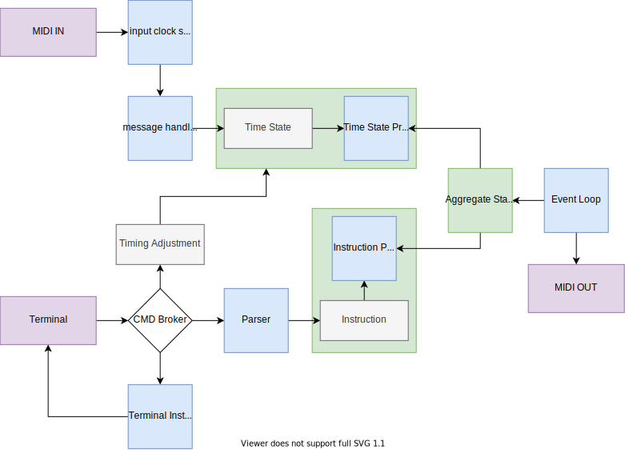

# musicode

(terrible name, placeholder for now)

## Table of Contents

- [API Commands](#api-commands)
  - [Instructions](#instructions)
    - [every](#every)
      - [meter](#meter)
      - [scale](#scale)
  - [reset](#reset)
  - [remove](#remove)
  - [register](#register)
  - [unregister](#unregister)
  - [log](#log)
  - [log:scales](#log:scales)
  - [log:state](#log:state)
  - [exit](#exit)
- [Development](#development)

## API Commands

### Instructions

_Instructions_ are how you write music in musicode.

Available instructions:

#### every

The basic idea of the `every` instruction is: `every N do X`

```sh
e <meter> <scale>
```

You can enter as many `every` instructions as you want. They can be removed via
the [`remove`](#remove) command.

**IMPORTANT!**

All metric and scale related numbers are **not** zero indexed in order to be
more musical, however internally the numbers _are_ zero indexed as is typical in
all code and is the output you'll see if you run the [`log:state`](#log:state)
command. An option to use zero indexed values may be added in the future.

##### meter

`meter` is a three part value consisting of `<bar>.<beat>.<sixteenth>`. We will
refer to one part within these three as a _metric_.

A metric can be:

- A single number:
  - [1-Infinity] for the bar portion
  - [0-3] for the beat and sixteenth portions
- The wildcard operator `*`, which means "every"
- The modulus operator `%` before a number, meaning "every other". For example
  `%2` will play on the 1 and 3 beats / sixteenths
- A list of values holding to the same rules as the single number, comma
  seperated, ie. `1,3`

##### scale

After entering a meter, you must specify a scale, which consists of a
`scaleNumber` and `scaleDegree`.

```sh
# scale 1, scale degree 1
s1 1
```

The `1` after can be omitted when specifiying scale number 1.

```sh
# same as previous example
s 1
```

Scales can be registered via the [`register`](#register) command

**Examples:**

```sh
# on the first beat of the first bar, play scale degree 1 from scale number 1
> e 1.1.1 s 1

# every beat
> e *.*.1 s 1

# every sixteenth note
> e *.*.* s 1

# every oher sixteenth note on beats 1 and 3
> e *.1,3.%2 s 1

# ...which is the same as
> e *.%2.%2 s 1
```

## reset

Reset musicode's internal timing data. This is useful to when manually trying
resync the program if it was started after a MIDI clock had started.

## remove

```sh
> remove <instructionId>
```

Remove a previously entered instruction. You can see a list of all id,
instruction pairs by running the [`log`](#log) command.

## register

```sh
> register major 1,3,5,6,8,10,12
```

Use the register command to enter your own custom scale. After entering your
scale it will be printed along with scale number you can use to reference it in
[instructions](#instructions)

## log

Print a list of registered phrases `<id>: <command>`. The id portion can later
be used to transform and remove phrases

```sh
> log
1: e *.1.1 s 1
2: e *.*.* s 2
```

## log:scales

Print a list of registered phrases `<id>: <command>`. The id portion can later
be used to transform and remove phrases

```sh
> log:scales
1: major 1,3,5,6,8,10,12
```

### log:state

This is mostly for development purposes. Prints out internal timing state and
compiled instructions.

### exit

Exit the program

## Development

Basic overview:



## Road to Version 1 TODO:

- export
- specify octave, duration, velocity
- transpose instruction(s)
- pass config file to program
- allow specifying scales in traditional notes
- add offset (bar|beat|sixteenth) command to resync
- cc
- make parsed types a constant enum

Expand syntax (thinking out loud):

```sh
# alternate scale degrees 1,2,3 each repetition (etc for velocity and duration)
# requires we keep a pointer to last played
> e *.*.* s 1,2,3 v 1,2 d 1

# play every 16th, but only 10% of the time
> e *.*.*/1 s 1

# transpose instruction 1 up 2
> x t1 2

# transpose instruction 1 down 2
> x t1 -2

# transpose all instructions down 2
> x t -2
```
